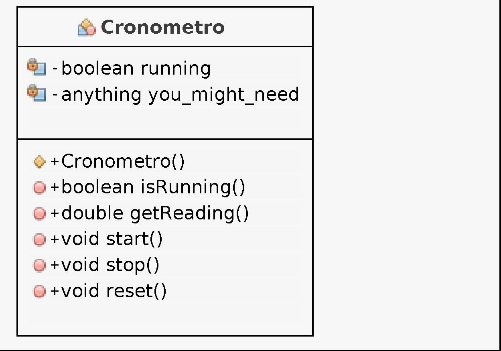

# Cronometro
Dato il seguente diagramma di classe implementare la classe Cronometro ed una classe che ne testi le funzionalità di base.
## Note
* la dicitura *anything you_might_need* significa che potete aggiungere gli attributi che ritenete opportuni per implementare la classe;
* il metodo *getReading()* deve restituire la lettura attuale del cronometro;
* i metodi *start()* e *stop()* devono rispettivamente avviare e fermare il conteggio;
* il metodo *start()* non ha alcun effetto se il cronometro è *running*;
* il metodo *stop()* non ha alcun effetto se il cronometro non è *running*;
* il metodo *reset()* non ha alcun effetto se il cronometro è *running*, altrimenti azzera la lettura.
* per leggere il clock di sistema, potete usare il metodo *System.nanotime()*.

## WARNINGS
**NON** è consentito cambiare la firma dei metodi, e **nemmeno** il tipo restituito!!!